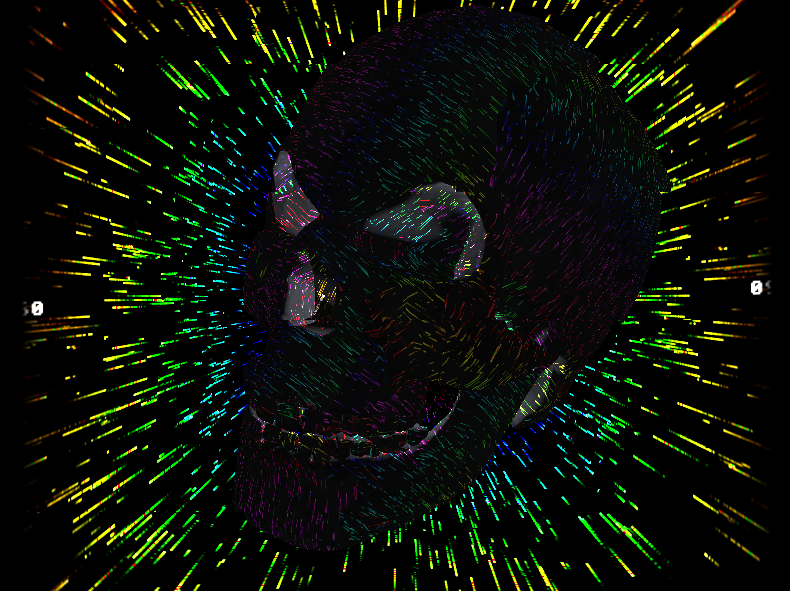

FBGraphics : Custom rendering backend
=====

## GLFW

FBG OpenGL 3.x+ rendering backend with GL utilities, multi-platform, use the [GLFW](https://www.glfw.org/) and [GLEW](http://glew.sourceforge.net/) library.

**How it work** : An OpenGL texture is updated in real-time with a FB Graphics context content, as such all FB Graphics draw calls work but are handled by the CPU and the resulting frame buffer is handled by the GPU, you are free to call any OpenGL calls and mix software rendered graphics with accelerated graphics.

It is also possible to modify the way the FBG display buffer is rendered through a shader, see the advanced example where the software rendered background is actually the FBG buffer with a fragment shader applied to it.

### Documentation

See the FB Graphics documentation.

### Basic usage 

Just call `fbg_glfwSetup` then any FB Graphics calls can be used.

`fbg_glfwClear` can also be useful (a wrapper to glClear)

`fbg_glfwShouldClose` can be used to know when the user close the window.

### Advanced usage

This backend has a lightweight OpenGL library which ease some of the most cumbersome things when starting OpenGL projects such as VBO/VAO/FBO creations, shaders loading (from files or strings), textures creation from FBG images, etc.

It also has built-in OpenGL debugging when `DEBUG` is defined.

The `glfw_example_advanced.c` demonstrate nearly all features and mix 2D graphics (FBG) with 3D graphics.




### Simple example

Draw a red rectangle (handled by CPU) bouncing off the screen borders, see `glfw_example` and its `makefile`:

```c
#include <sys/stat.h>
#include <signal.h>
#include <stdlib.h>
#include <math.h>

#include "glfw/fbg_glfw.h"

int keep_running = 1;

void int_handler(int dummy) {
    keep_running = 0;
}

int main(int argc, char* argv[]) {
    struct _fbg *fbg = fbg_glfwSetup(800, 600, "glfw example", 0, 0);
    if (fbg == NULL) {
        return 0;
    }

    float x = 0, y = 0, velx = 3.4, vely = 3.425;

    signal(SIGINT, int_handler);

    do {
        fbg_glfwClear();
        
        fbg_clear(fbg, 0);
        fbg_draw(fbg);

        fbg_rect(fbg, x, y, 40, 40, 255, 0, 0);

        fbg_flip(fbg);

        x += velx;
        y += vely;

        if (x <= 0 || x > fbg->width - 40) {
            velx = -velx;
        }

        if (y <= 0 || y > fbg->height - 40) {
            vely = -vely;
        }
    } while (keep_running && !fbg_glfwShouldClose(fbg));

    fbg_close(fbg);
}
```

